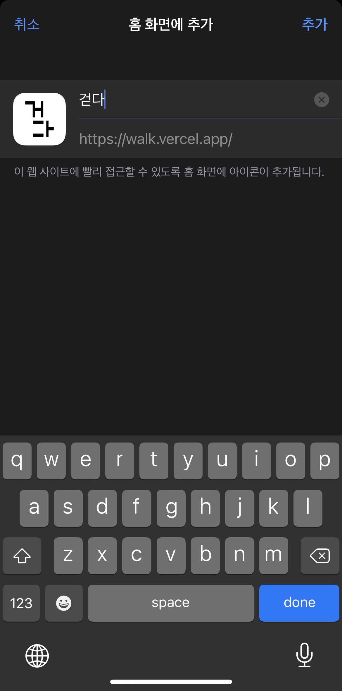

# 걷다

보행자에게 주변 신호등 정보와 대기시간을 제공하는 서비스 입니다.

### 개발 동기

평소 걸어다니면서 주변 신호등 정보를 외우고 최적화된 경로로 이동을 하는 것을 선호하는 데, 낯선 지역에서 신호 정보를 몰라서 불편함을 겪었던 적이 많았습니다.
위와 같은 생각을 하는 불특정 다수가 있다는 것을 깨닫고, 공공 API가 제공돼서 나와 같은 불특정 다수에게 도움을 주고 싶어서 서비스를 만들게 됐습니다.

### 🏃‍♂️ [배포](https://walk.vercel.app/)

### 📚[개발 과정](https://velog.io/@ungun96/걷다)

# 사용 화면

### 내 주변 신호 정보 제공

### 지도 중심 2km 반경 신호 정보 제공

# 모바일 최적화

  
  
  

  
 ### 홈 화면에 추가 버튼을 이용해서 web app으로 사용할 수 있습니다.
 
 
 
 ### PWA 적용

# 기술 스택

  ### Next.js 
  * Code splitting
  * Zero Config
  * 공공 API 요청만 필요하므로 따로 서버 구축없이 Next 자체 서버로 API 요청, 응답 처리 가능
  
  ### Typescript
  * Static Type으로 컴파일 단계 오류 포착 가능
  * IDE에서 정보 표시로 개발 효율 증가
  * API Data Modeling으로 데이터 파악 용이

  ### Recoil 
  * 보일러 플레이트 없이 간결하고 최소 단위로 전역 상태 관리 가능
  
  ### React-Query
  * 서버 요청 및 응답 상황에 따른 데이터 관리에 용이

# 서비스 가능 지역

  
  
  ⛔️ 현재 API가 서울의 특정 지역에서만 제공돼서 앱 또한 제한적으로 제공됩니다.
  
  ⛔️ API가 불안정해서 응답값이 오지 않는 경우도 있습니다.

# 추가 개선 사항

1. 신호 정보 상태에 맞는 API 요청 최적화
2. 유저의 이동 속도와 신호 시간 계산을 적용한 길찾기 알고리즘 구현으로 유저에게 최적의 루트 제공

#### Current Version 1.0.0
